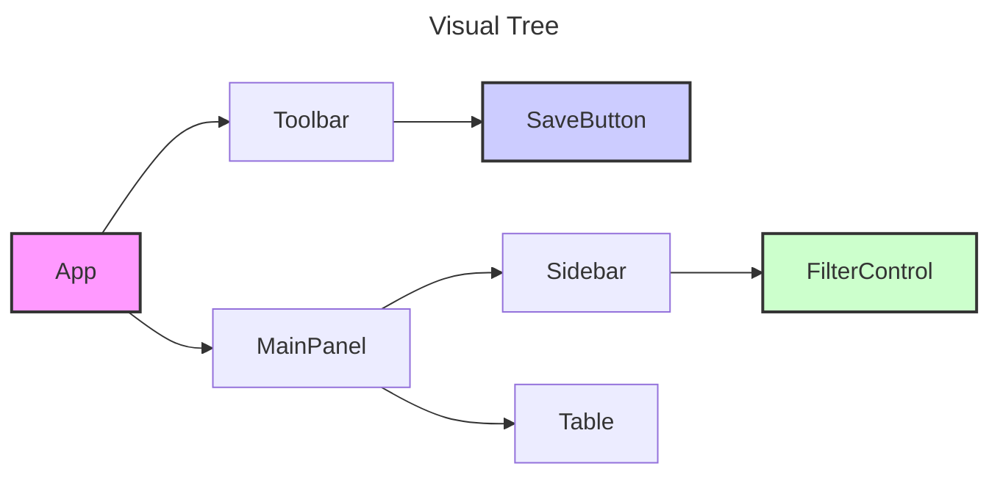
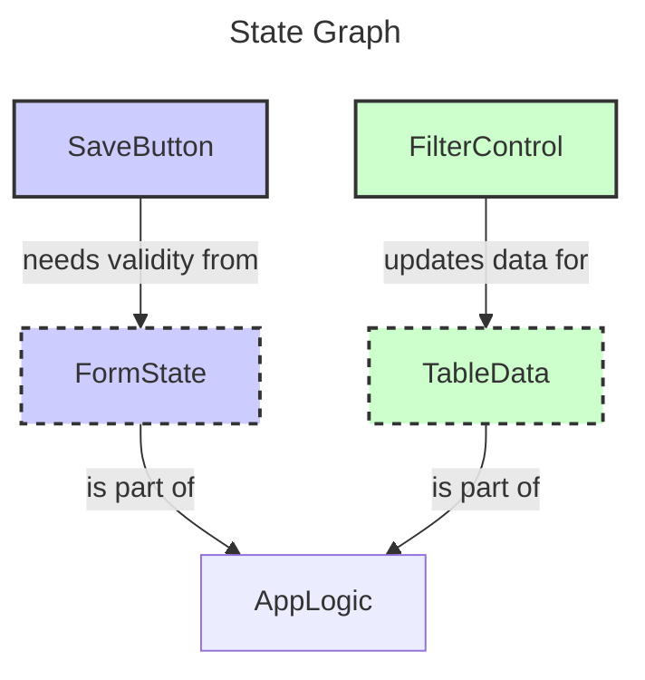
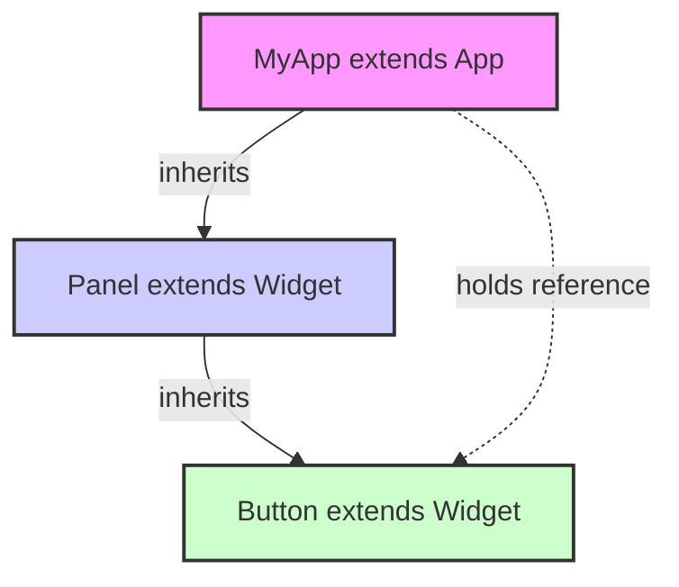
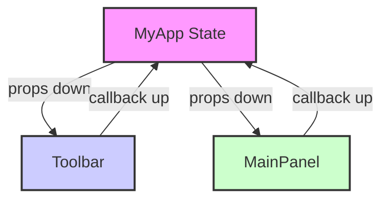
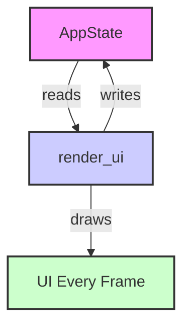
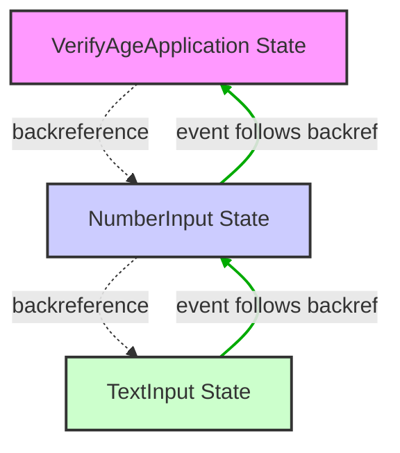
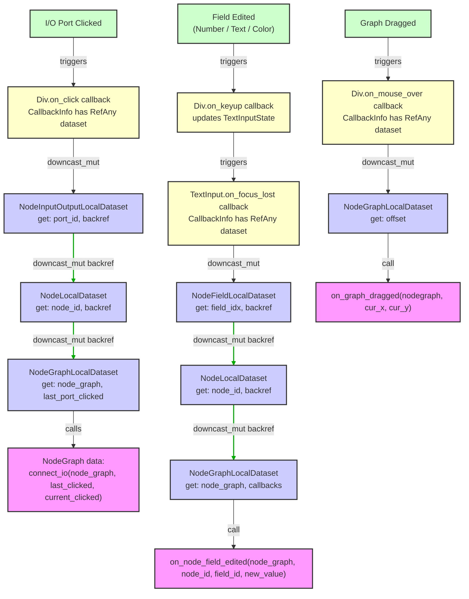

# Application Architecture

## Introduction

Building graphical user interfaces has, despite its perceived simplicity, been 
a difficult problem in computer science. Despite a constant progress in languages, 
libraries, design patterns and compilers, developers face the same fundamental 
problems in user interfaces that they did 40 years ago: managing state, synchronizing 
application data with what users see, and enabling communication between distant 
components without creating a spaghettified mess.

The root of this struggle lies in a core conflict that nearly every toolkit fails to 
properly address: the conflict between the "Visual Tree" (the hierarchy of object on the screen) 
and the "State Graph" (the logical relations between components interacting with each other).

*   The "Visual Tree" is the hierarchy of elements as they appear on the screen. It is always 
    a tree: a window contains a panel, which contains a button. Its structure is defined by 
    layout and presentation.
*   The "State Graph" is the map of how application data and logic are connected. A filter 
    control in a toolbar (`Visual Tree` -> `Toolbar` -> `Filter Data`) needs to alter the 
    data displayed in a completely separate table  (`Visual Tree` -> `MainPanel` -> `Table`) _without_
    the two pieces being merged in a "FilterDataTableWithToolbar", as that will create a 
    complete mess once the interactions become more complex.

Second, the biggest problem (especially confronted by React), is the inherent object-oriented mindset
of web browsers, with operations such as `dom.addChild` or `removeChild` or `nodeABC.delete`: when 
something gets visually deleted, the nodes dependent on `nodeABC` need to be updated too, otherwise
they now point to stale visual objects.

## Prior Art

The key insight of Azul is that this network of dependencies is a complex _graph_, not a 
simple _tree_ and fusing them together (via a "minimum common ancestor approach") creates
the unmaintainable mess of most modern UIs.





The "pain" of UI programming stems from frameworks that either fuse them 
together or awkwardly force the graph to conform to the shape of the tree.

### Fused Hierarchy [OOP]

The first generation of toolkits (Qt, GTK, MFC, Swing) were built on an 
object-oriented model - not because it was necessary, but because it was 
considered "best practice". The paradigm was simple: the UI is a tree of 
stateful objects. A `Button` object holds its own text and state, a `MyCustomPanel` 
object inherits from `Panel` and adds its own data and logic, objects are
then composed in a hierarchy until you get to the parent "window" object.

```python
# OOP Paradigm
class MyApp(othertoolkit.App):
    # ...
    def on_click():
        # text_input implicitly comes from othertoolkit.App
        input = self.text_input.getText()
        calculated = do_somthing_with_input(input)
        self.output.setText(calculated)
        self.text_input.setText(„“)
```



In this model, the Visual Tree and the State Graph are fused. The object inheritance 
hierarchy _is equal to_ the visual hierarchy. This immediately creates real problems:

*   Communication between logically related but visually distant components requires complex 
    pointer management (in JS, reference management - no crash but not much better), global 
    mediator objects, or a web of signal-and-slot connections that are difficult to
    trace and maintain (Qts meta-object-compiler).
*   Changing the visual layout in this paradigm forces a refactoring of the class hierarchy, 
    which makes developing applications in such toolkits painful and creates hard dependencies 
    on the toolkit itself (leading to „toolkit wars“, like the battle over GTK vs Qt). 
    The application logic is not testable in isolation without the framework
    because it is fundamentally inseparable from the UI objects themselves.
*   It creates a hard dependency on the toolkit itself. Your application logic is not 
    portable or reusable because it is fundamentally intertwined with the toolkit's base 
    classes, rendering system, and event model.

### Constrained Hierarchy [Elm, React]

The next major step, led by frameworks like React, Angular and the Elm Architecture, 
introduced a new functional paradigm: `UI = f(data)`. The UI is a declarative, pure 
function of the application's state. This was revolutionary at the time, as it solved the 
problem of state synchronization. When the data is changed, the framework efficiently updates 
the view to match instead of manually needing a `setText()` call ("two-way data binding").

```python
# React Paradigm Model
def MyApp():
    input_value, set_input_value = useState("")
    output_value, set_output_value = useState("")

    def handle_click():
        calculated = do_something_with_input(input_value)
        set_output_value(calculated)
        set_input_value(„“)

    return Page(children=[
        TextInput(value=input_value, on_change=set_input_value),
        Button(on_click=handle_click),
        Label(text=output_value)
    ])
```



However, while these frameworks finally decouple the view from imperative manipulation, they 
still constrain the flow of data to the shape of the Visual Tree. The example above works 
because `TextInput`, `Button`, and `Label` are all siblings, children of `MyApp`. But what if 
the `Button` were in a `Toolbar` and the `TextInput` and `Label` were in a `MainContent` panel? 

React's solution is to „lift state up“ to their lowest common ancestor, `MyApp`. The `MyApp` 
component must now hold the state and pass both the data and the callback functions down through the 
intermediate components.

```python
def MyApp():
    # State is lifted to the common ancestor
    input_value, set_input_value = useState("")

    # ... logic also lives in the ancestor ...

    return Page(children=[
        # Toolbar is now forced to accept and pass down a prop it doesn't use
        Toolbar(on_button_click=handle_click),
        # MainContent is also forced to pass props
        MainContent(
            input_value=input_value,
            on_input_change=set_input_value,
            output_value=output_value
        )
    ])
```

Here, the State Graph is still being forced into the tree structure of the view, leading 
to "prop drilling" and components with indirect APIs. The existence of complex "escape hatches" 
like Redux or the Context API is evidence of this core constraint—they are patterns invented 
to work around this default tree-based data flow.

Elms solution goes even further to „lift all state up“ to the root ancestor and route everything 
in a single, top-level "update" function. Elm therefore represents the philosophical extreme 
of the constrained hierarchy:

1.  **Model:** The entire state of the application is held in a single, immutable data structure.
2.  **View:** A pure function that takes the `Model` and returns a description of the UI.
3.  **Update:** A single, central function that is the only entity allowed to modify the state.

It does so by taking an incoming `Msg` (a message from the UI) and the current state, and
producing a *new* state.

### Ignoring Hierarchy (IMGUI)

Immediate Mode toolkits (IMGUI) take a different approach. The paradigm is to have no persistent 
UI objects at all; the UI is redrawn from scratch from application data every single frame. This 
solves synchronization issue by brute force but shoves the problem of application architecture 
onto the developer instead of the framework - leading to a "minimal, opinionated framework", but
serious problems with layouting and accessibility.

```python
# IMGUI Paradigm Model
class AppState:
    input_buffer = ""
    output_text = ""

# Inside the main application loop, every frame
def render_ui(app_state):
    ui.text_input("Input:", &app_state.input_buffer)
    if ui.button("Calculate"):
        calculated = do_something_with_input(&app_state.input_buffer)
        app_state.output_text = calculated
        app_state.input_buffer.clear()
    ui.label(&app_state.output_text)
```



IMGUI doesn't solve the Visual Tree vs. State Graph problem — it just largely ignores the problem 
and instead creates a _hidden data binding_ in a "closure with captured arguments" instead of a 
"class with state and functions": 


While the form is different from OOP, the operation (and the problem) is the same. A closure is 
just a function on a struct containing all captured variables. The effect is the same as a class-with-methods, 
but on top of that, it provides even less layout flexibility than object-oriented code.

Immediate Mode GUI does solve the synchronization problem, but it fails at the other two core 
problems of GUIs: data access and inter-widget communication.

## Intermediate Considerations

### Why Electron Won

The success of Electron is (besides practical reasons) likely a consequence of the _architectural_ 
superiority of Reactive over OOP frameworks. In the 2010s, developers were moving to the declarative 
web paradigm - not because it provided more features, but primarily because it was more maintainable 
than the 1990s-era OOP model. When tasked with building a desktop application, they had a choice: 
revert to the painful, fused hierarchy paradigm of Qt or GTK, lock themselves to a certain vendor toolkit, 
or use the more modern (yet still constrained) hierarchy of React.

Electron provides the bridge - while many developers were probably unconscious about it, they chose it 
not for its stellar performance (or lack of it), but for its better paradigm, as they were now free to
use much more functional-ish frameworks than whatever XAML hell Microsoft was presenting at the time. 
The native desktop world had no answer to this at the time, so developers accepted the performance cost 
and tons of build-tool workarounds as a necessary evil.

Azul is not an answer to the Reactive or OOP mindset. It doesn't try to reinvent "Electron, but in Rust" 
or "React, but in Rust". Instead, it tries to build a different paradigm: acknowledging the theoretical 
idea of `UI = f(data)` but fusing it with the practical reality that the final application will always be
a "messy graph", and it's better to "contain" the mess rather than trying to out-theorize it.

### What is the essence of a UI toolkit?

A question that sometimes comes up in discussions is how a "GUI toolkit" differs from a "rendering library".
This is the second distinction between the major paradigms or classes of "GUI toolkits". One could mainly 
categorize the toolkit by its handling of the following three "hard problems":

1.  **Data Access / Model-View separation:** Somehow a callback needs access to both the data model (i.e.
    the class) and the stateful UI object (to scrape the text out), but at the same time the „data model“
    should be as far removed from the UI as possible, so that logic functions do not depend on view data (`my_ui_object.getText()`).
2.  **Synchronization:** It is very easy for the visual UI state and the data model to go out of sync.
    Solutions so far include "Observer patterns" (callbacks that run when something changes), React-like
    reconciliation or "just redraw everything" (IMGUI).
3.  **Inter-widget communication:** This is the hardest problem to solve, as it's not directly obvious 
    in TodoMVC-esque applications. Existing toolkits assume that the widget hierarchy (visual tree) and
    the inheritance (or function call) hierarchy are the same (using the least common ancestor as a 
    channel, either via OOP inheritance or via React-style prop drilling). Other solutions involve 
    observable cells of functionality (`useMemo` / `useEffect` in SolidJS), which the framework then 
    coordinates (downside: moves the "mess" implicitly into the framework instead of the user code).

Overall, immediate-mode libraries do not solve these problems at all, instead shoving the responsibility 
for managing state onto the application programmer in the name of "freedom". Well, "freedom" in GUI state 
management is simply a euphemism for "we don't actually have a clue on how to manage state" - at least saying
that would be simply more honest.

## Starting again from scratch

So, if we could free our mind conceptually from both OOP and Reactive programming, what would a 
"proper toolkit look like? By "proper" it means that it solves the problems above and scales to 
larger (500K - 1 million lines of code) applications without becoming an unmaintainable mess.

### Encoding Visual Hierarchy

The first thing we'd need to decide is whether we'd like to serialize the UI or render it directly 
(IMGUI), without first storing it. The choice here is relatively obvious, because the former creates
instant opportunity for introspection of the visual state (such as in a HTML debugger). The 
counter-argument against this has been traditionally "performance", but when testing Azuls memory 
profile, this effectively came up as a non-issue: the entire DOM with styling in even a large 
application is only ~500KB - 1MB of actual data.

In terms of efficiency there is a massive upside to this, as we don't need to redraw the entire
screen just to blink a cursor, which enables power savings on low-powered devices. Second, it also
nicely maps to how computers execute - compare the XML hierarchy to function call stacks:

```html
<div class="parent">
    <div class="child"></div>
    <div class="child"></div>
    <div class="child"></div>
</div>
```

with:

```python
div(class="parent", children = [
    div(class="child")
    div(class="child")
    div(class="child")
])
```

Composing UI hierarchies via functions makes much more sense than composing UI hierarchies via 
inheritance because the latter is often language-specific and not supported in all languages, 
whereas functions are language agnostic.

### Encoding Data Access

The second decision is where to store the UI data, so that the callbacks may access it again.
Widget-specific data has to be either stored on the programmer side (in the application, using 
inheritance or traits) or in the framework (either using data attributes or - worse - global state 
modifying functions such as synchronous `setColor(RED); draw(); swap();` calls). 
What format should we use?

Inheritance-based toolkits only allow one format: You have to inherit from a UI object and then 
construct your application as a series of UI objects. Azul however, stores the application data 
as an implementation-agnostic `RefAny` struct: similar to `PyObject` or Javascripts `Object` it 
just stores "some data", but the toolkit doesn't know what the type is. You can upcast your data 
and wrap it via `RefAny::new` and then get immutable or mutable access again via `.downcast_ref()` 
or `.downcast_mut()`, respectively:

```rust
let data = RefAny::new(5); // owns the data
let data_clone = data.clone(); // only bumps the reference count

let data_ref: &usize = data.downcast_ref::<usize>().unwrap(); // ok
println!(„{}“, *data); // prints „5“

let data_mut: &mut usize = data.downcast_ref::<usize>().unwrap(); // error: data_ref still held
// object destroyed here
```

Effectively this is similar to `Observables`, however, since `RefAny`s are connected to a `Callback`, 
a `Dom`, a `Task` or a `Thread`, the topology of how they are connected is more obvious than 
with a free-floating `Observable`, whose memory lives merely "somewhere".

The biggest upside here is that this model makes the framework C-compatible (as Rust closures or traits 
can never be expressed in the C ABI). The biggest downside of this is that we need an extra 
"upcast / downcast" system, as well as heap memory allocation.

Using [insert language]s module system, we can however minimize (and in practice completely avoid) 
any errors related to up / downcasting by controlling the visibility of the thing we're downcasting 
to - effectively making the "blast radius" of a type casting error so minimal that it becomes 
irrelevant in practice:

```rust
// number_input.rs (private internals)
struct NumberInputInternal { /* ... */ }

// number_input.rs (public API)
pub struct NumberInput {
    internal: NumberInputInternal,
}

impl NumberInput {
    pub fn dom(self) -> Dom {
        let on_the_fly = RefAny::new(self.internal); // upcast
        Dom::new().with_callback(private_callback, on_the_fly)
    }
}

extern „C“
fn private_callback(data: RefAny, info: CallbackInfo) -> Update {
    // downcast - as NumberInputInternal is private to this module,
    // only code in this module can downcast to NumberInputInternal
    // external code can't even name the type, so no downcast error possible
    let d = data.downcast::<NumberInputInternal>().unwrap();
}
```

This way, once a decent amount of test coverage is done, the "internals" of any widget
are hidden from the outside completely. When all references to a `RefAny` are deleted, 
the internal object is deleted, too (running either a default or custom destructor).

### Building a State Graph

The pattern that naturally emerged from this `RefAny` + `Callback` was the "backreference"
pattern: storing a `RefAny` + `Callback` inside of a `RefAny`, designing public APIs of widgets
in a "dependency injection" style.

The goal of this is to pass data / callbacks of a higher-level data model directly down to 
a lower-level component during DOM construction, without having to "prop drill" any data / 
callbacks through intermediary components / middleware, but also, in difference to OOP, keep
both components "in the dark" about each other. The only way where it's necessary to know the 
relations is in the executed callback: exactly where we'd expect some form of complexity, and
where we could use a debugger to "step through" a potential downcast failure.

## Examples

### Simple: Input Validation

To explain this new concept more concrete, let's build a number input that wraps a text input 
and validates that the user typed a number > 18 in a `VerifyAgeApplication`. This demonstrates the 
backreference pattern in its simplest form — a linear chain from low-level (`TextInput`) 
through mid-level (`NumberInput`) to high-level application logic (`VerifyAgeApplication`).

`TextInput` is the lowest-level, azul-provided widget that manages text and provides 
hooks for validation. It doesn't know anything about number validation or age validation.
What it does know is "I should call this callback when the focus was lost".

```python
class TextInput:
    text: String
    user_focus_lost_callback: Optional[Tuple[RefAny, Callback]]

    def __init__(self, text):
        self.text = text
        self.user_focus_lost_callback = None

    def set_on_focus_lost(self, data, callback):
        # Allow higher-level widgets to hook into focus loss
        self.user_focus_lost_callback = tuple(data, callback)

    def dom(self):
        dom = Dom.text(self.text)
        refany = RefAny(self)
        dom.set_callback(On.TextInput, refany, _on_text_input)
        dom.add_callback(On.FocusLost, refany, _on_focus_lost)
        return dom

# PRIVATE to TextInput module, updates TextInput.text internal state
def _on_text_input(data, callbackinfo):
    data.text += callbackinfo.get_text_changeset().text
    # no callbackinfo.preventDefault(), so text input will continue
    return Update.DoNothing

# PRIVATE to TextInput module, calls the user-provided validation callback
def _on_focus_lost(data, callbackinfo):
    # When focus is lost, invoke the user-provided callback if it exists
    if data.user_focus_lost_callback is None:
        return Update.DoNothing
    
    user_data, user_callback = data.user_focus_lost_callback
    return user_callback(user_data, callbackinfo, data.text)
```

`NumberInput` now wraps `TextInput` and adds validation logic. It again 
holds a backreference to *its* parent (in this case `VerifyAgeApplication`) via 
`on_number_input`:

```python
class NumberInput:
    number: Integer
    on_number_input: Optional[Tuple[RefAny, Callable]]

    # default NumberInput() constructor
    def __init__(self, number):
        self.number = number
        self.on_number_input = None

    def set_on_number_input(self, data, callback):
        # Store a backreference to the application‚s callback
        self.on_number_input = (data, callback)

    def dom(self):
        ti = TextInput(str(self.number))
        # Pass a backreference to *this* NumberInput down to TextInput
        ti.set_on_focus_lost(RefAny(self), _validate_text_input_as_number)
        return ti.dom()

# PRIVATE to NumberInput module
def _validate_text_input_as_number(data, callbackinfo, string):
    # This callback receives the NumberInput's data
    if data.on_number_input is None:
        return Update.DoNothing

    number = string_to_number(string)
    if number is None:
        return Update.DoNothing  # Invalid input; ignore silently

    # Validation passed! Now invoke the application callback
    app_data, app_callback = data.on_number_input
    return app_callback(app_data, callbackinfo, number)
```

The top-level application logic of `VerifyAgeApplication` is then completely 
decoupled from UI concerns, and can expect the NumberInput to call it back 
with a number, not a string (so the validation logic has already passed):

```python
class VerifyAgeApplication:
    user_age: int

    def __init__(self, initial_age):
        self.user_age = initial_age

def layout_func(data, layoutinfo):
    # uses the public interface of NumberInput
    # doesn't care about how it's implemented internally
    ni = NumberInput(data.user_age)
    # Pass a backreference to the application down to NumberInput
    ni.set_on_number_input(data, _on_age_input)
    # turns NumberInput into a plain DOM subtree
    return Dom.createBody()
        .withChild(ni.dom())

# PRIVATE to VerifyAgeApplication
def _on_age_input(data, callbackinfo, new_age):
    # This callback only runs if the input was a valid number
    if new_age < 18:
        MsgBox.ok("You must be older than 18 to proceed")
        return Update.DoNothing
    else:
        data.user_age = new_age
        return Update.RefreshDom

app = App(VerifyAgeApplication(18), AppConfig(LayoutSolver.Default))
app.run(WindowCreateOptions(layout_func))
```

The key here is that no matter how complex the application gets in its "State Graph", 
it is now decoupled from any "Visual Tree", i.e. from the visual hierarchy itself.



When the user now finishes editing and the input loses focus, the event flows 
through the backreferences:

1. `_on_focus_lost(RefAny<TextInput>, text_string)`
2. `_validate_text_input_as_number(RefAny<NumberInput>, text_string)`
3. `_on_age_input(RefAny<MyApplication>, validated_number)`

Each level knows only about its immediate parent via the backreference. `TextInput` has 
no knowledge of `VerifyAgeApplication`, and `VerifyAgeApplication` has no knowledge of the specific UI widget 
being used. The State Graph is explicit: `VerifyAgeApplication → NumberInput → TextInput`.

This pattern scales to arbitrary depth. You could create an `EmailInput` that wraps 
`TextInput` and validates email format, or a `CreditCardInput` that validates card IDs. 
Each layer simply adds logic without coupling to the layers above or below.

### Complex: Node Graph Editor

The power of backreferences becomes even clearer with non-hierarchical state dependencies. 
Consider a node graph editor, where the logical connections between nodes (a complex graph) 
have no real relation to their visual layout (a flat list of sibling elements on a canvas).

The challenge of a node graph is that the logical connections between nodes (a complex graph) 
have no relation to their visual layout (a flat list of sibling elements on a canvas). In the 
`NodeGraph`, when a user clicks an input port on a node, how does the widget tell the top-level 
`NodeGraph` state to create a connection? It doesn't send a message "up" the Visual Tree. 
Similar to the `TextInput`, it follows a pre-defined "chain of backreferences" (operating on the 
"Logical Graph"):

1.  The `Dom` for the input port has a callback holding a `PortWidget`'s data.
2.  This `PortWidget` contains a backreference to its logical parent‚s data, the `NodeWidget`.
3.  The `NodeWidget` in turn holds a backreference to the top-level `NodeGraphWidget`, which contains
    the entire application state.

The callback for the click event on a visual node's `Input` / `Output` simply follows 
this chain of references, making a direct jump from the event source to the top-level data model.

```python
# Pseudo-code illustrating the backreference chain
# These are not UI elements, but only the logical controllers for them

class NodeGraphWidget:
    def __init__(self, graph_state):
        self.graph_state = graph_state  # The actual application data

    # Logic that lives at the top level
    def on_port_clicked(self, port_id):
        print(f"LOGIC(NodeGraph): Port {port_id} clicked. Updating global state.")
        # ... logic to connect nodes in self.graph_state ...

class NodeWidget:
    def __init__(self, node_id, graph_widget_ref):
        self.node_id = node_id
        self.graph_widget_ref = graph_widget_ref  # Backreference to the graph

    # This method is „lent“ to the PortWidget
    def on_port_clicked(self, port_id):
        print(f"LOGIC(Node): Click received for port {port_id}. Forwarding to graph."")
        # Uses its backreference to call the top-level logic
        self.graph_widget_ref.on_port_clicked(port_id)

class PortWidget:
    def __init__(self, port_id, node_widget_ref):
        self.port_id = port_id
        self.node_widget_ref = node_widget_ref  # Backreference to the node

    # This would be the callback attached to the UI element
    def handle_click_event(self):
        print(f"EVENT on Port {self.port_id}"")
        # Uses its backreference to start the logical chain
        self.node_widget_ref.on_port_clicked(self.port_id)
```

Wiring it all up:

```python
# Top-level state and logic controller
app_state = {"nodes": {}, "connections": []}
graph_controller = NodeGraphWidget(app_state)

# 2. Create controllers for child components, passing down backreferences
node_a_controller = NodeWidget("NodeA", graph_controller)
port_a1_controller = PortWidget("PortA1", node_a_controller)

# 3. Simulate a user clicking the visual port
port_a1_controller.handle_click_event()
```

The flow of control follows the logical graph, not the visual tree:

1. `Event` -> `PortWidget.handle_click_event()` 
2. `PortWidget.handle_click_event()` -> `NodeWidget.on_port_clicked()` 
3. `NodeWidget.on_port_clicked()` -> `NodeGraphWidget.on_port_clicked()`

This data flow is completely independent of the visual layout and the intermediary middleware flow
is completely hidden at the highest level - which makes testing much simpler and decouples the actual 
callback from the entire framework (in tests you can pass in a mock RefAny and test that it changed).
The `PortWidget` is perfectly decoupled; it doesn't know what the `NodeGraphWidget` is, only that 
it must call a function on the reference it was given.

In the "real-world" NodeGraph, the flow is more complex, but the pattern scales horizontally,
irrespective of the number of events that the graph needs to handle or the complexity of the 
graphs features.



## Summary

This document was mostly theoretical, but it's important to read because the main "reason d'etre" 
(reason for existence) of "Why Azul?" doesn't lie in the technical choices (webrender vs vello, Rust 
vs Zig vs C++), but in the novel *architecture* approach, which hasn't been replicated this 
way (the closest match to this approach is Apples SwiftUI, interestingly enough).

This document should help developers understand not only the goal of Azul, but also the "why" of 
their pain points in GUI programming - because someone who cannot articulate a problem cannot solve it.

## Coming Up Next

- [Understanding RefAny](architecture/understanding-refany.md) — RefAny helps you to share and store type-erased data between callbacks and threads
- [Document Object Model](dom.md) — The Dom tree - node types, hierarchy, and CSS
- [Styling with CSS](styling.md) — Stylesheets, selectors, and the cascade
- [Events](events.md) — Callbacks, event filters, and how state triggers relayout
