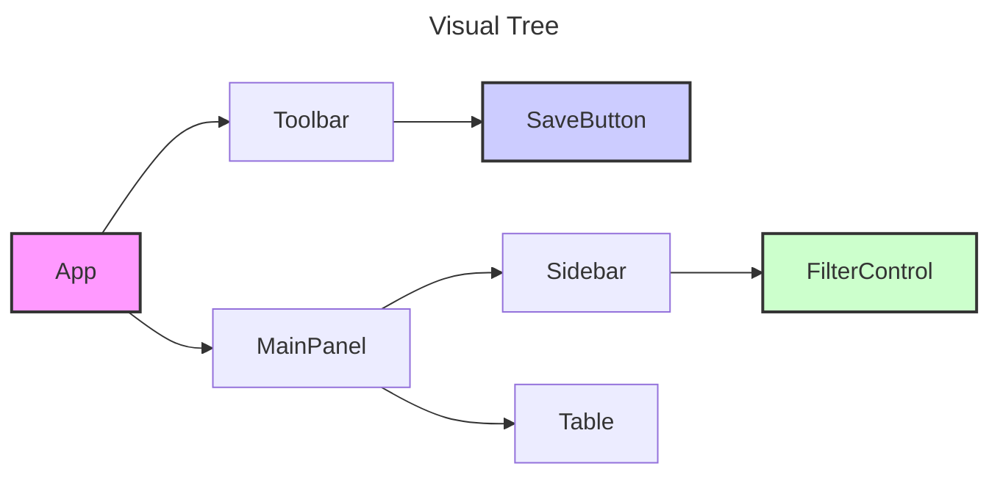
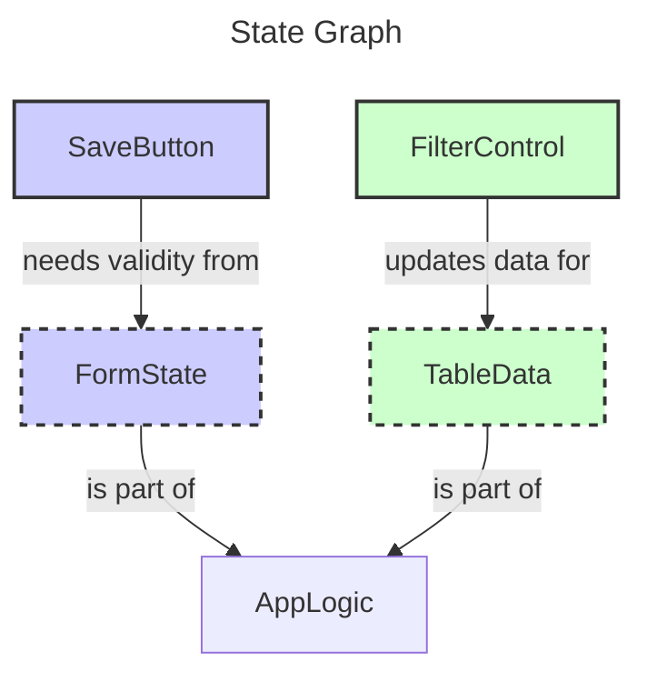
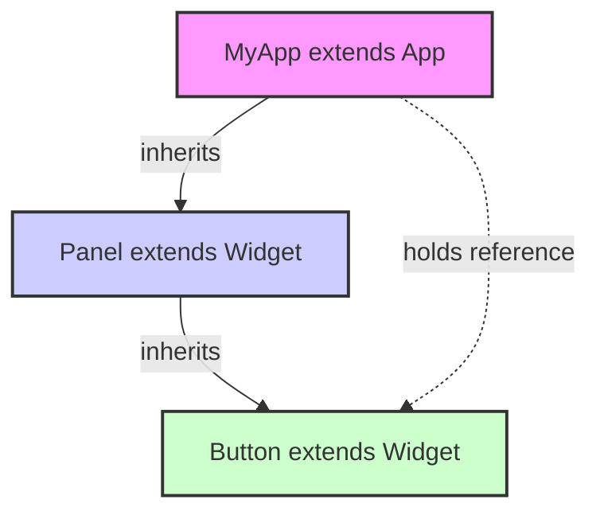
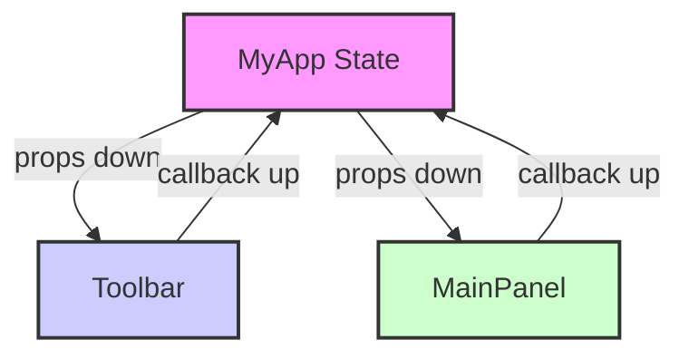
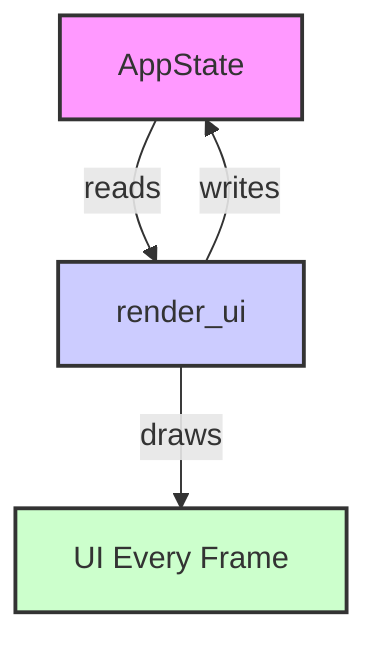
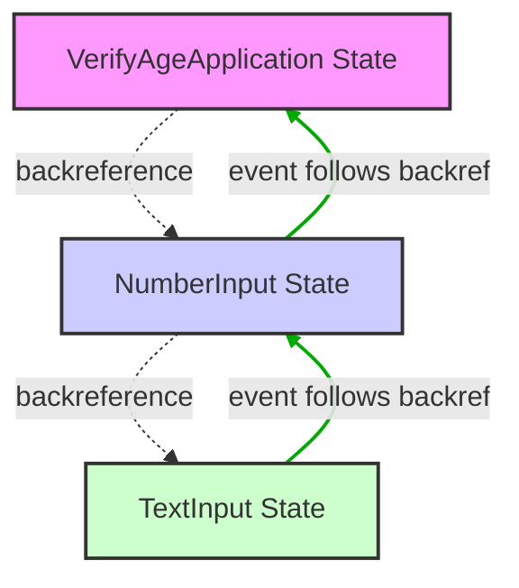
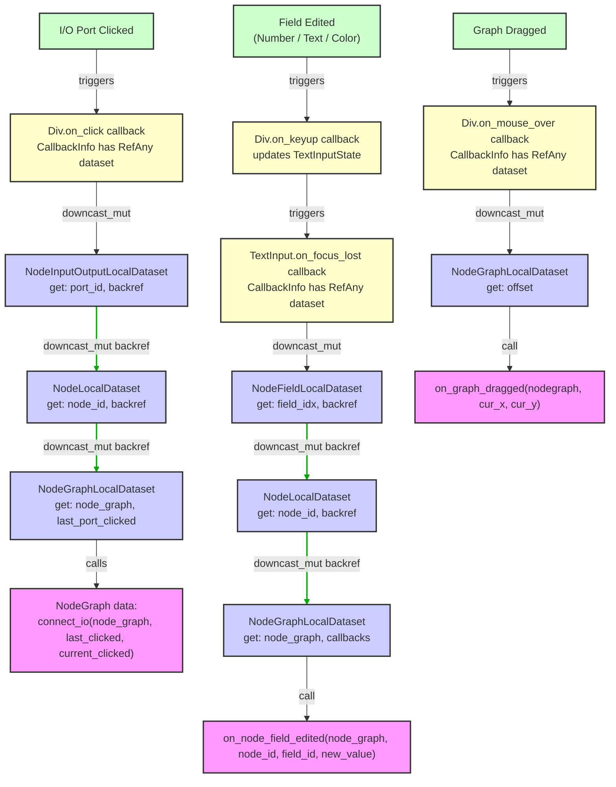
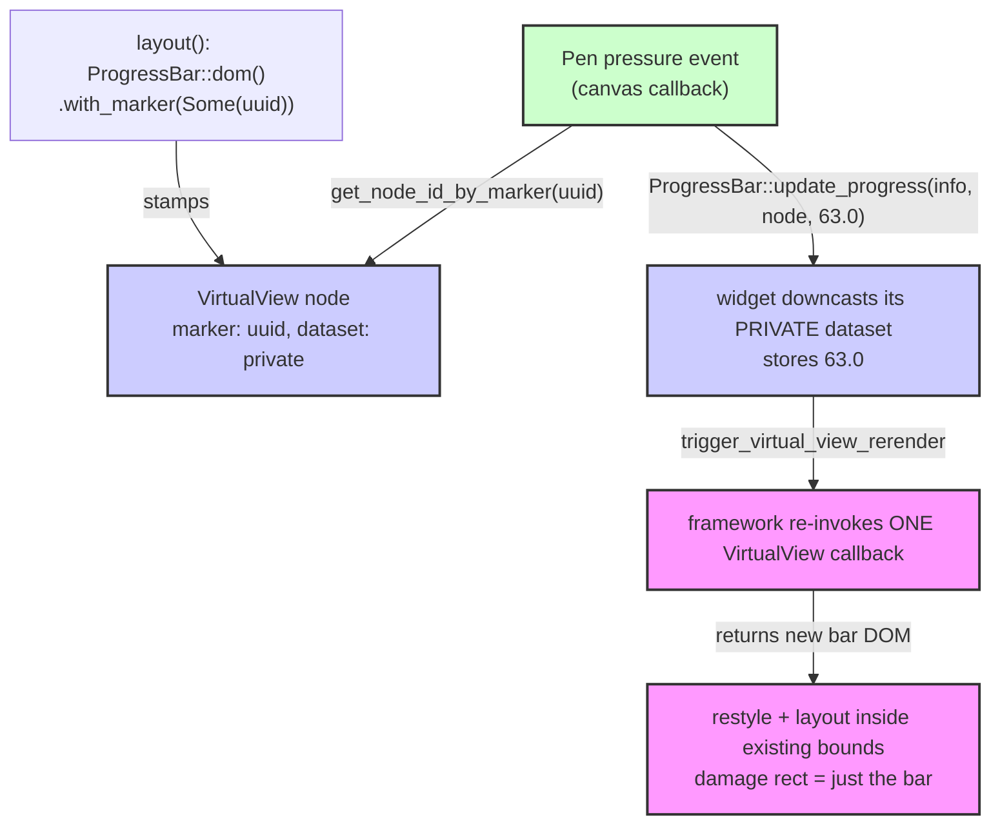

# Application Architecture

## Introduction

Building graphical user interfaces has, despite its perceived simplicity, been 
a difficult problem in computer science. Despite a constant progress in languages, 
libraries, design patterns and compilers, developers face the same fundamental 
problems in user interfaces that they did 40 years ago: managing state, synchronizing 
application data with what users see, and enabling communication between distant 
components without creating a spaghettified mess.

The core thesis of Azul is that this struggle lies in a core conflict that nearly every 
toolkit fails to properly address: a conflict between the "Visual Tree" (the hierarchy of object on the screen, such as `div.foo > p > ::text`) 
and the "State Graph" (the logical relations between components interacting with each other, 
such as `Toolbar <-> TreeView <-> Table`).

*   The "Visual Tree" is the hierarchy of elements as they appear on the screen. It is always 
    a tree: a window contains a panel, which contains a button. This hierarchy is pretty much 
    present in all but the most primitive UI frameworks, because you need some form of logical 
    grouping for layouting, unless the layout is calculated manually.
*   The "State Graph" is the map of how application data and logic are connected. A filter 
    control in a toolbar (`Visual Tree` -> `Toolbar` -> `Filter Data`) needs to alter the 
    data displayed in a completely separate table  (`Visual Tree` -> `MainPanel` -> `Table`) without
    the two pieces being merged in a "FilterDataTableWithToolbar", as that will create a 
    complete mess once the interactions become more complex.

The second biggest problem of UIs is the question: How do we handle the inherent mutability of UI components? Mutable APIs such as in web browsers only hand you a `dom.addChild(c)` function and expect you to do the synchronization back to your application data model yourself. Other solutions such as SolidJS trigger hooks whenever your data model changes, or create a diff between two full virtual DOM trees (such as in React).

## Prior Art

The key insight of Azul is that this network of dependencies is a complex _graph_, not a 
simple _tree_ and fusing them together (via a "minimum common ancestor approach") creates
the unmaintainable mess of most modern UIs.


```mermaid
---
title: Visual Tree
---
graph LR
    v_App[App] --> v_Toolbar[Toolbar] & v_MainPanel[MainPanel]
    v_Toolbar --> v_SaveButton[SaveButton]
    v_MainPanel --> v_Sidebar[Sidebar] & v_Table[Table]
    v_Sidebar --> v_FilterControl[FilterControl]

    classDef app fill:#f9f,stroke:#333,stroke-width:2px
    classDef button fill:#ccf,stroke:#333,stroke-width:2px
    classDef control fill:#cfc,stroke:#333,stroke-width:2px

    class v_App app
    class v_SaveButton button
    class v_FilterControl control
```


```mermaid
---
title: State Graph
---
graph TD
    s_SaveButton[SaveButton] -- "needs validity from" --> s_FormState[FormState]
    s_FilterControl[FilterControl] -- "updates data for" --> s_TableData[TableData]
    s_FormState -- "is part of" --> s_AppLogic[AppLogic]
    s_TableData -- "is part of" --> s_AppLogic

    classDef button fill:#ccf,stroke:#333,stroke-width:2px
    classDef control fill:#cfc,stroke:#333,stroke-width:2px
    classDef state fill:#ccf,stroke:#333,stroke-width:2px,stroke-dasharray: 5 5
    classDef data fill:#cfc,stroke:#333,stroke-width:2px,stroke-dasharray: 5 5

    class s_SaveButton button
    class s_FilterControl control
    class s_FormState state
    class s_TableData data
```

The "pain" of UI programming stems from frameworks that either fuse them 
together or awkwardly force a node graph to conform to the shape of the tree.

### Fused Hierarchy [OOP]

The first generation of toolkits (Qt, GTK, MFC, Swing) were built on an 
object-oriented model - not because it was necessary, but because it was 
considered „best practice“. The paradigm was simple: the UI is a tree of 
stateful objects, therefore would be logical to put the custom behaviour of a `Button` right on an extended instance - hence the need for "object-oriented" inheritance. A `MyCustomPanel` 
object inherits from `Panel` and adds its own data and logic, objects are
then composed in a hierarchy of *types* (not values) until you get to the parent „window“ object.

```python
# OOP Paradigm
class MyPanel(othertoolkit.Panel):
    # ...
    def on_click():
        # text_input implicitly comes from othertoolkit.App
        input = self.text_input.getText()
        calculated = do_somthing_with_input(input)
        self.output.setText(calculated)
        self.text_input.setText("")
```


```mermaid
graph TD
    A[MyApp extends App] -->|inherits| B[Panel extends Widget]
    B -->|inherits| C[Button extends Widget]
    A -.->|holds reference| C
    
    style A fill:#f9f,stroke:#333,stroke-width:2px
    style B fill:#ccf,stroke:#333,stroke-width:2px
    style C fill:#cfc,stroke:#333,stroke-width:2px
```

In this model, the Visual Tree and the State Graph are fused. The object inheritance 
hierarchy _is equal to_ the visual hierarchy. This immediately creates real problems:

*   Communication between logically related but visually distant components requires complex 
    pointer management (in JS, reference management - no crash but not much better), global 
    mediator objects, or a web of signal-and-slot connections that are difficult to
    trace and maintain (Qts meta-object-compiler).
*   Changing the visual layout in this paradigm forces a refactoring of the class hierarchy, 
    which makes developing applications in such toolkits painful and creates hard dependencies 
    on the toolkit itself (leading to „toolkit wars“, like the battle over GTK vs Qt). 
    The application logic is not testable in isolation without the framework
    because it is fundamentally inseparable from the UI objects themselves.
*   It creates a hard dependency on the toolkit itself. Your application logic is not 
    portable or reusable because it is fundamentally intertwined with the toolkit's base 
    classes, rendering system, and event model.

### Constrained Hierarchy [Elm, React]

The next major step, led by frameworks like React, Angular and the Elm Architecture, 
introduced a new functional paradigm: `UI = f(data)`. The UI is a declarative, pure 
function of the application's state. When the data is changed, the framework efficiently updates 
the view to match instead of manually needing a `setText()` call ("two-way data binding").

```python
# React Paradigm Model
def MyApp():
    input_value, set_input_value = useState("")
    output_value, set_output_value = useState("")

    def handle_click():
        calculated = do_something_with_input(input_value)
        set_output_value(calculated)
        set_input_value("")

    return Page(children=[
        TextInput(value=input_value, on_change=set_input_value),
        Button(on_click=handle_click),
        Label(text=output_value)
    ])
```


```mermaid
graph TD
    A[MyApp State] -->|props down| B[Toolbar]
    A -->|props down| C[MainPanel]
    B -->|callback up| A
    C -->|callback up| A
    
    style A fill:#f9f,stroke:#333,stroke-width:2px
    style B fill:#ccf,stroke:#333,stroke-width:2px
    style C fill:#cfc,stroke:#333,stroke-width:2px
```

However, while these frameworks finally decouple the view from imperative manipulation, they 
still constrain the flow of data to the shape of the Visual Tree. The example above works 
because `TextInput`, `Button`, and `Label` are all siblings, children of `MyApp`. But what if 
the `Button` were in a `Toolbar` and the `TextInput` and `Label` were in a `MainContent` panel? 

React's solution is to „lift state up“ to their lowest common ancestor, `MyApp`. The `MyApp` 
component must now hold the state and pass both the data and the callback functions down through the 
intermediate components.

```python
def MyApp():
    # State is lifted to the common ancestor
    input_value, set_input_value = useState("")

    # ... logic also lives in the ancestor ...

    return Page(children=[
        # Toolbar is now forced to accept and pass down a prop it doesn't use
        Toolbar(on_button_click=handle_click),
        # MainContent is also forced to pass props
        MainContent(
            input_value=input_value,
            on_input_change=set_input_value,
            output_value=output_value
        )
    ])
```

Here, the State Graph is still being forced into the tree structure of the view, leading 
to "prop drilling" and components with indirect APIs. The existence of "escape hatches" 
like Redux or the Context API is evidence of this core constraint - they are patterns invented 
to work around this default tree-based data flow.

Elms solution goes even further to „lift all state up“ to the root ancestor and route everything 
in a single, top-level "update" function. Elm therefore represents the philosophical extreme 
of the constrained hierarchy:

1.  **Model:** The entire state of the application is held in a single, immutable data structure.
2.  **View:** A pure function that takes the `Model` and returns a description of the UI.
3.  **Update:** A single, central function that is the only entity allowed to modify the state.

Elm does this by taking an incoming `Msg` (a message from the UI) and the current state, and
producing a *new* state.

### Ignoring Hierarchy (IMGUI)

Immediate Mode toolkits (IMGUI) have no persistent 
UI objects at all; the UI is redrawn from scratch from application data every single frame. This 
solves synchronization issue by brute force but shoves the problem of application architecture 
onto the developer instead of the framework - programmers now have to store lots of "UI state" as 
part of their application data model, such as focus state, scroll positions, caches, etc. Immediate 
mode toolkits are mainly popular with game development overlays, but not much outside of that, 
simply because the inherent complexity of UIs is now shoved onto the application instead of the 
framework, which isn't much of a help.

```python
# IMGUI Paradigm Model
class AppState:
    input_buffer = ""
    output_text = ""

# Inside the main application loop, every frame
def render_ui(app_state):
    ui.text_input("Input:", &app_state.input_buffer)
    if ui.button("Calculate"):
        calculated = do_something_with_input(&app_state.input_buffer)
        app_state.output_text = calculated
        app_state.input_buffer.clear()
    ui.label(&app_state.output_text)
```


```mermaid
graph TD
    A[AppState] -->|reads| B[render_ui]
    B -->|writes| A
    B -->|draws| C[UI Every Frame]
    
    style A fill:#f9f,stroke:#333,stroke-width:2px
    style B fill:#ccf,stroke:#333,stroke-width:2px
    style C fill:#cfc,stroke:#333,stroke-width:2px
```

IMGUI doesn't solve the Visual Tree vs. State Graph problem - it just largely ignores the problem 
and instead creates a _hidden data binding_ in a "closure with captured arguments" instead of a 
"class with state and functions".

While the form is different from OOP, the operation (and the problem) is the same. A closure is 
just a function on a struct containing all captured variables. The effect is the same as a class-with-methods, 
but on top of that, it provides even less layout flexibility than object-oriented code, because the UI drawing functions juggles the raw values around (to calculate the layout) instead of abstracting them in more "declarative" objects and letting the framework solve the layout.

## What is the essence of a UI toolkit?

A question that sometimes comes up in programming discussions is how a "GUI toolkit" differs from a "rendering library".
One could mainly categorize GUI toolkits or libraries by their approach to handling the 
following three "hard problems":

1.  **Data Access / Model-View separation:** Somehow a callback needs access to both the data model (i.e.
    the application data) and the stateful UI object of the framework (to scrape the text out), but at the same time the „data model“
    should be as far removed from the UI as possible, so that logic functions do not depend on view data (`my_ui_object.getText()`).
2.  **Synchronization:** It is very easy for the visual UI state and the data model to go out of sync.
    Solutions so far include "Observer patterns" (callbacks that run when something changes, granular 
    reactivity), React-like reconciliation of entire DOM trees or "just redraw everything, and throw 
    the state away" (IMGUI).
3.  **Inter-widget communication:** This is the hardest problem to solve, as it's not directly obvious 
    in TodoMVC-esque applications. Existing toolkits assume that the widget hierarchy (visual tree) and
    the inheritance (or function call) hierarchy are the same (using the least common ancestor as a 
    channel, either via OOP inheritance or via React-style prop drilling). Other solutions involve 
    observable cells of functionality (`useMemo` / `useEffect` in SolidJS), which the framework then 
    coordinates.

Overall, rendering libraries do not solve these problems at all while frameworks usually do - sometimes 
using special features of the language itself such as in SwiftUI and Flutter.

## Starting again from scratch

So, if we could free our mind conceptually from both OOP and Reactive programming, what would a 
"proper" toolkit look like? By "proper" it means that it solves the problems above and scales to 
larger (500K - 1 million lines of code) applications without becoming an unmaintainable mess.

### Encoding Visual Hierarchy

The first thing we'd need to decide is whether we'd like to serialize the UI or render it directly 
(IMGUI). The choice here is relatively obvious, because the former creates
instant opportunity for introspection of the visual state (such as in a HTML debugger). The 
counter-argument against this has been traditionally "performance", but when testing Azuls memory 
profile, this effectively came up as a non-issue: the entire DOM with styling in even a large 
application is only ~500KB - 1MB of actual data.

In terms of efficiency there is also a massive upside to this: we can diff the DOMs state instead
of just getting new pixels, which gives the framework more semantic information to work with for
caching. Second, it also
nicely maps to how computers execute - compare the XML hierarchy to function call stacks:

```html
<div class="parent">
    <div class="child"></div>
    <div class="child"></div>
    <div class="child"></div>
</div>
```

with:

```python
div(class="parent", children = [
    div(class="child")
    div(class="child")
    div(class="child")
])
```

Composing UI hierarchies via functions makes much more sense than composing UI hierarchies via 
inheritance (OOP) or types (xilem) because the latter are often language-specific and not supported 
in all languages, whereas C-callback style function pointers are language agnostic.

### Encoding Data Access

The second decision is where to store the UI data, so that the callbacks may access it again.
Widget-specific data has to be either stored on the programmer side (in the application, using 
inheritance or traits) or in the framework. 
What format should we use?

Inheritance-based toolkits only allow one format: You have to inherit from a UI object and then 
construct your application as a hierarchy of UI objects. Azul stores the application data 
as an implementation-agnostic `RefAny` struct: similar to `PyObject` or Javascripts `Object` it 
just stores "some data as bytes" - together with minimal information about the class / data type. 
You can upcast any piece of data, wrap it via `RefAny::new` and then get immutable or mutable access again via `.downcast_ref()` 
or `.downcast_mut()`, respectively:

```rust
let data = RefAny::new(5); // owns the data
let data_clone = data.clone(); // only bumps the reference count

let data_ref: &usize = data.downcast_ref::<usize>().unwrap(); // ok
println!("{}", *data); // prints 5

// error: data_ref still held
let data_mut: &mut usize = data.downcast_ref::<usize>().unwrap();
// object destroyed when last reference to it is dropped
```

Effectively this is similar to an `Observable`, however, since `RefAny`s are usually connected to a 
`Callback`, a `Dom`, a `Task` or a `Thread`, the topology of how they are connected is more obvious.

While the up- and downcasting loses some type safety (we'll discover later how to work around this 
fact), the biggest upside here is that this model makes the framework C-compatible. If the framework 
would use Rust closures or traits, this would effectively make it unusable outside of Rust.

Using [insert language]s module system, we can minimize (and in practice completely avoid) 
any errors related to up / downcasting by controlling the *visibility* of the thing we're downcasting 
to - effectively making the "blast radius" of a type casting error so minimal that it becomes 
irrelevant in practice:

```rust
// number_input.rs (private internals)
struct NumberInputInternal { /* ... */ }

// number_input.rs (public API)
pub struct NumberInput {
    internal: NumberInputInternal,
}

impl NumberInput {
    pub fn dom(self) -> Dom {
        let on_the_fly = RefAny::new(self.internal); // upcast
        Dom::new().with_callback(private_callback, on_the_fly)
    }
}

extern „C“
fn private_callback(data: RefAny, info: CallbackInfo) -> Update {
    // downcast - as NumberInputInternal is private to this module,
    // only code in this module can downcast to NumberInputInternal
    // external code can't even name the type, so no downcast error
    let d = data.downcast::<NumberInputInternal>().unwrap();
}
```

This way, once a decent amount of test coverage is done, the „internals“ of any widget
are hidden from the outside completely. In the API of Azuls default widget set you'll often see `FooConfig` structs that carry the public "configuration" of said widget, which reflects this pattern. When all references to a `RefAny` are deleted, 
the internal object is then destroyed, running either a default null or custom destructor function. Additionally, the framework can keep "heavy" `RefAny` objects alive between two `layout()` calls, e.g. for storing things like a video decoder handle or a map tile cache, where the cached data belongs neither in the application data model nor in the framework built-in as a primitive - read more in the [Merge Callbacks](./dom/merge-callbacks.md) guide.

### Building a State Graph

The architectural pattern that naturally emerges from this `RefAny` + `Callback` is the „backreference“ or "dependency injection" pattern: you can store a `RefAny` + `Callback` inside of a `RefAny`, which allows you to design public APIs of widgets
in a „dependency injection“ style, without the need for "prop drilling".

The goal of this is to pass data / callbacks of a higher-level data model directly down to 
a lower-level component during DOM construction, without having to „prop drill“ any data / 
callbacks through intermediary components / middleware, but also, in difference to OOP, keep
both components „in the dark“ about each other. The only way where it's necessary to know the 
relations is in the executed callback: exactly where we'd expect some form of complexity, and
where we could use a debugger to „step through“ a potential downcast failure. Since this is all very theoretical, let's look at some examples:

## Examples

### Simple: Input Validation

To explain this concept more concretely, let's build a number input that wraps a text input 
and validates that the user typed a number > 18 in a `VerifyAgeApplication`. This demonstrates the dependency injection pattern in its simplest form - a linear chain from low-level (`TextInput`) 
through mid-level (`NumberInput`) to high-level application logic (`VerifyAgeApplication`), all extending each other without inheritance.

At its core, text input is handled by marking a text node `contenteditable`. On top of that, the `TextInput` then provides a relatively basic API on top, similar to what a web browser would offer. It provides a hook for "any" validation when receiving a `focusout` event - whether that callback then validates input as a number, a regex match or a date validation - the `TextInput` itself doesn't care. It doesn't know anything about number validation or age validation. The only thing it knows is „I should call this callback when the focus was lost, which will return true or false“.

```python
class TextInput:
    text: String
    user_focus_lost_callback: Optional[Tuple[RefAny, Callback]]

    def __init__(self, text):
        self.text = text
        self.user_focus_lost_callback = None

    def set_on_focus_lost(self, data, callback):
        # Allow higher-level widgets to hook into focus loss
        self.user_focus_lost_callback = tuple(data, callback)

    def dom(self):
        dom = Dom.text(self.text)
        refany = RefAny(self)
        dom.set_callback(On.TextInput, refany, _on_text_input)
        dom.add_callback(On.FocusLost, refany, _on_focus_lost)
        return dom

# PRIVATE to TextInput module, updates TextInput.text internal state
def _on_text_input(data, callbackinfo):
    data.text += callbackinfo.get_text_changeset().text
    # no callbackinfo.preventDefault(), so text input will continue
    return Update.DoNothing

# PRIVATE to TextInput module, calls the user-provided validation callback
def _on_focus_lost(data, callbackinfo):
    # When focus is lost, invoke the user-provided callback if it exists
    if data.user_focus_lost_callback is None:
        return Update.DoNothing
    
    user_data, user_callback = data.user_focus_lost_callback
    return user_callback(user_data, callbackinfo, data.text)
```

`NumberInput` as a "superclass" of `TextInput` now wraps `TextInput` and adds number-specific validation logic. It again 
holds a field for a dependency-injected callback to *its* superclass (in this case `VerifyAgeApplication`) via 
`on_number_input`:

```python
class NumberInput:
    number: Integer
    on_number_input: Optional[Tuple[RefAny, Callable]]

    # default NumberInput() constructor
    def __init__(self, number):
        self.number = number
        self.on_number_input = None

    def set_on_number_input(self, data, callback):
        # Store a backreference to the application‚s callback
        self.on_number_input = (data, callback)

    def dom(self):
        ti = TextInput(str(self.number))
        # Pass a backreference to *this* NumberInput down to TextInput
        ti.set_on_focus_lost(RefAny(self), _validate_text_input_as_number)
        return ti.dom()

# PRIVATE to NumberInput module
def _validate_text_input_as_number(data, callbackinfo, string):
    # This callback receives the NumberInput's data
    if data.on_number_input is None:
        return Update.DoNothing

    number = string_to_number(string)
    if number is None:
        return Update.DoNothing  # Invalid input; ignore silently

    # Validation passed! Now invoke the application callback
    app_data, app_callback = data.on_number_input
    return app_callback(app_data, callbackinfo, number)
```

Finally, the top-level application logic of `VerifyAgeApplication` is then completely 
decoupled from UI concerns. The application can expect the `NumberInput` to call it back 
with a number, not a string (so the validation logic has already passed). It can therefore concentrate completely on the "business logic" aspect while the input validation is abstracted away and already done by the time this callback is reached:

```python
class VerifyAgeApplication:
    user_age: int

    def __init__(self, initial_age):
        self.user_age = initial_age

def layout_func(data, layoutinfo):
    # uses the public interface of NumberInput
    # doesn't care about how it's implemented internally
    ni = NumberInput(data.user_age)
    # Pass a backreference to the application down to NumberInput
    ni.set_on_number_input(data, _on_age_input)
    # turns NumberInput into a plain DOM subtree
    return Dom.createBody()
        .withChild(ni.dom())

# PRIVATE to VerifyAgeApplication
def _on_age_input(data, callbackinfo, new_age):
    # This callback only runs if the input was a valid number
    if new_age < 18:
        MsgBox.ok("You must be older than 18 to proceed")
        return Update.DoNothing
    else:
        data.user_age = new_age
        return Update.RefreshDom

app = App(VerifyAgeApplication(18), AppConfig(LayoutSolver.Default))
app.run(WindowCreateOptions(layout_func))
```

The key here is that no matter how complex the application gets in its „State Graph“, it is now decoupled from any „Visual Tree“, i.e. from the visual hierarchy, the `Dom`, itself.


```mermaid
graph TD
    A[VerifyAgeApplication State] -.->|backreference| B[NumberInput State]
    B -.->|backreference| C[TextInput State]
    C -->|event follows backref| B
    B -->|event follows backref| A
    
    linkStyle 2 stroke:#0a0,stroke-width:2px
    linkStyle 3 stroke:#0a0,stroke-width:2px
    
    style A fill:#f9f,stroke:#333,stroke-width:2px
    style B fill:#ccf,stroke:#333,stroke-width:2px
    style C fill:#cfc,stroke:#333,stroke-width:2px
```

When the user now finishes editing and the input loses focus, the event flows 
through the backreferences:

1. `_on_focus_lost(RefAny<TextInput>, text_string)`
2. `_validate_text_input_as_number(RefAny<NumberInput>, text_string)`
3. `_on_age_input(RefAny<MyApplication>, validated_number)`

Each level knows only about its immediate parent via the backreference and can be unit-tested individually. `TextInput` has 
no knowledge of `VerifyAgeApplication`, and `VerifyAgeApplication` has no knowledge of the specific UI widget 
being used. Additionally, its data model does *not* contain any handle to the input widget - instead it only stores the user's age and re-creates the text input widget. The framework will then take care of keeping scroll positions, focus and cursor positions in the exact same place.

This pattern scales to arbitrary depth. You could create an `EmailInput` that wraps 
`TextInput` and validates email format, or a `CreditCardInput` that validates card IDs. 
Each layer simply adds logic without coupling to the layers above or below.

### Complex: Node Graph Editor

The power of backreferences becomes even clearer with non-hierarchical state dependencies. 
Consider a node graph editor, where the logical connections between nodes (a complex graph) 
have no real relation to their visual layout (a flat list of sibling elements on a canvas).

In the 
`NodeGraph`, when a user clicks an input port on a node, how does the widget tell the top-level 
`NodeGraph` state to create a connection? It doesn't send a message „up“ the Visual Tree. 
Similar to the `TextInput`, it follows a pre-defined „chain of backreferences“ (operating on the „Logical Graph“):

1.  The `Dom` for the input port has a callback holding a `PortWidget`'s data.
2.  This `PortWidget` contains a backreference to its logical parent, the `NodeWidget`.
3.  The `NodeWidget` in turn holds a backreference to the top-level `NodeGraphWidget`, which contains
    the entire application state.

The callback for the click event on a visual nodes' `Input` / `Output` simply follows 
this chain of references, making a direct jump from the event source to the top-level data model.

```python
# Pseudo-code illustrating the backreference chain
# These are not UI elements, but only the logical controllers for them

class NodeGraphWidget:
    def __init__(self, graph_state):
        self.graph_state = graph_state  # The actual application data

    # Logic that lives at the top level
    def on_port_clicked(self, port_id):
        print(f"LOGIC(NodeGraph): Port {port_id} clicked. Updating global state.")
        # ... logic to connect nodes in self.graph_state ...

class NodeWidget:
    def __init__(self, node_id, graph_widget_ref):
        self.node_id = node_id
        self.graph_widget_ref = graph_widget_ref  # Backreference to the graph

    # This method is „lent“ to the PortWidget
    def on_port_clicked(self, port_id):
        print(f"LOGIC(Node): Click received for port {port_id}. Forwarding to graph."")
        # Uses its backreference to call the top-level logic
        self.graph_widget_ref.on_port_clicked(port_id)

class PortWidget:
    def __init__(self, port_id, node_widget_ref):
        self.port_id = port_id
        self.node_widget_ref = node_widget_ref  # Backreference to the node

    # This would be the callback attached to the UI element
    def handle_click_event(self):
        print(f"EVENT on Port {self.port_id}"")
        # Uses its backreference to start the logical chain
        self.node_widget_ref.on_port_clicked(self.port_id)
```

Wiring it all up:

```python
# Top-level state and logic controller
app_state = {"nodes": {}, "connections": []}
graph_controller = NodeGraphWidget(app_state)

# 2. Create controllers for child components, passing down backreferences
node_a_controller = NodeWidget("NodeA", graph_controller)
port_a1_controller = PortWidget("PortA1", node_a_controller)

# 3. Simulate a user clicking the visual port
port_a1_controller.handle_click_event()
```

The flow of control again follows the logical graph:

1. `Event` -> `PortWidget.handle_click_event()` 
2. `PortWidget.handle_click_event()` -> `NodeWidget.on_port_clicked()` 
3. `NodeWidget.on_port_clicked()` -> `NodeGraphWidget.on_port_clicked()`

During testing, you can simply pass in a mock `RefAny` and test that this part of your application or this widget hits all branches (in code coverage) and that it modifies the state / calls the expected callback - making it "UI testable" without there being any actual UI. The key is that the `PortWidget` doesn't know what the `NodeGraphWidget` is, only that 
it must call a function on the reference it was given.

In the "real-world" NodeGraph, the flow is more complex, but the pattern scales horizontally,
irrespective of the number of events that the graph needs to handle or the complexity of the 
graphs features.


```mermaid
graph TD
    E3["I/O Port Clicked"] -->|triggers| UI3["Div.on_click callback<br/>CallbackInfo has RefAny dataset"]
    UI3 -->|downcast_mut| NIOLD["NodeInputOutputLocalDataset<br/>get: port_id, backref"]
    NIOLD -->|downcast_mut backref| NLD2["NodeLocalDataset<br/>get: node_id, backref"]
    NLD2 -->|downcast_mut backref| NGC3["NodeGraphLocalDataset<br/>get: node_graph, last_port_clicked"]
    NGC3 -->|calls| D3["NodeGraph data:<br/>connect_io(node_graph, last_clicked, current_clicked)"]
    
    E4["Field Edited<br/>(Number / Text / Color)"] -->|triggers| UI4A["Div.on_keyup callback<br/>updates TextInputState"]
    UI4A -->|triggers| UI4B["TextInput.on_focus_lost callback<br/>CallbackInfo has RefAny dataset"]
    UI4B -->|downcast_mut| NFLD["NodeFieldLocalDataset<br/>get: field_idx, backref"]
    NFLD -->|downcast_mut backref| NLD3["NodeLocalDataset<br/>get: node_id, backref"]
    NLD3 -->|downcast_mut backref| NGC4["NodeGraphLocalDataset<br/>get: node_graph, callbacks"]
    NGC4 -->|call| D4["on_node_field_edited(node_graph, node_id, field_id, new_value)"]
    
    E5["Graph Dragged"] -->|triggers| UI5["Div.on_mouse_over callback<br/>CallbackInfo has RefAny dataset"]
    UI5 -->|downcast_mut| NGC5["NodeGraphLocalDataset<br/>get: offset"]
    NGC5 -->|call| D5["on_graph_dragged(nodegraph, cur_x, cur_y)"]

    classDef event fill:#cfc,stroke:#333,stroke-width:2px
    classDef ui fill:#ffc,stroke:#333,stroke-width:2px
    classDef dataset fill:#ccf,stroke:#333,stroke-width:2px
    classDef data fill:#f9f,stroke:#333,stroke-width:2px
    
    class E3,E4,E5 event
    class UI3,UI4A,UI4B,UI5 ui
    class NIOLD,NFLD,NLD2,NLD3,NGC3,NGC4,NGC5 dataset
    class D3,D4,D5 data
    
    linkStyle 2,3,8,9 stroke:#0a0,stroke-width:2px
```

## Inter-widget communication

The last problem is a rare occurrence but occasionally happens: How do we connect two widgets, where the modification of a widget has to lead to a visual change of the other, without the other widget knowing what the UI structure looks like? In the previous examples, we used a full `layout()` call to make sure the UI is always synchronized and relied on the framework to keep things like focus, cursor and scroll positions in-place across multiple `layout()` calls. However, for very fast changes, Azul offers things like `info.set_css_property()` to quickly modify a CSS property.

In the `AzPaint` demo we have a canvas which can respond to pen input at up to 140 packets per second - on the side of the canvas we also have a `ProgressBar` to reflect the pen pressure (i.e. from 0 to 100). So, how do we keep the UI in sync here? The "easy way" would be to put the pressure in the application data, update it on every `On::Touch` event and call `layout()` and rely that the frameworks caching is good enough.

1. Store the pressure in the app's data model
2. Return `Update::RefreshDom`
3. `layout()` runs again, the DOM is diffed, the bar is rebuilt at the new width

This would work - but it would be a bit wasteful. Instead, we want to "connect" the `Canvas` and the `ProgressBar` showing the pressure strength without calling `layout()` and then keep the logic for updating the `ProgressBar` contained in its own API, so the `Canvas` doesn't need to know anything about the UI structure of the `ProgressBar`.

Azul offers a "fast path" for these scenarios:

**1.** During `layout()`, the app creates a
fresh `Uuid::short()` string and annotates the "connected" `Dom` node with this marker. Then, it copies this `Uuid` into the callback-local `RefAny`. The marker UUID here acts like an HTML `id`, except that it is **invisible to CSS and doesn't affect node equality** - creating a fresh UUID on every `layout()` doesn't affect the diff, so no `Mount` / `Unmount` events fire by accident.

```rust,no_run
// layout(): mint the address and stamp it on the widget...
let marker = Uuid::short();
let bar = ProgressBar::create(0.0)
    .dom()
    .with_marker(Some(marker.clone()).into());
// ...and keep the same string in the state the canvas callbacks get.
```

**2.** When the canvas now receives pressure, its
callback resolves the marker to a node id, then hands that node to a
function that the `ProgressBar` widget exports:

```rust,no_run
extern "C" fn on_pen_move(mut data: RefAny, mut info: CallbackInfo) -> Update {
    let pressure = 63.0; // from info.get_pen_state()
    let marker = match data.downcast_ref::<PaintState>() {
        Some(s) => s.pressure_marker.clone(), // the Uuid layout() minted
        None => return Update::DoNothing,
    };
    if let Some(node) = info.get_node_id_by_marker(marker).into_option() {
        ProgressBar::update_progress(info, node, pressure);
    }
    Update::DoNothing // nothing else changed - and the bar STILL moves
}
```

Almost like magic, the `ProgressBar` now updates on pressure, without any new calls to `layout()` - so what's going on here?

**3.** Internally, `ProgressBar::dom()` creates a minimal `VirtualView` for the actual bar - a `VirtualView` is usually used for infinite content, but can also be used for "sections" of a `Dom`, that can create a new sub-`Dom` and update it dynamically.


```mermaid
graph TD
    L["layout(): ProgressBar::dom()<br/>.with_marker(Some(uuid))"] -->|stamps| N["VirtualView node<br/>marker: uuid, dataset: private"]
    E["Pen pressure event<br/>(canvas callback)"] -->|"get_node_id_by_marker(uuid)"| N
    E -->|"ProgressBar::update_progress(info, node, 63.0)"| P["widget downcasts its PRIVATE dataset<br/>stores 63.0"]
    P -->|trigger_virtual_view_rerender| F["framework re-invokes ONE VirtualView callback"]
    F -->|"returns new bar DOM"| R["restyle + layout inside existing bounds<br/>damage rect = just the bar"]

    classDef event fill:#cfc,stroke:#333,stroke-width:2px
    classDef dataset fill:#ccf,stroke:#333,stroke-width:2px
    classDef data fill:#f9f,stroke:#333,stroke-width:2px
    class E event
    class N,P dataset
    class F,R data
```

This is, however, an exception for performance reasons, not the usual case. The `ProgressBar` then triggers a `info.rerender_virtual_view(node_id)`, which queues its "bar" for being recreated - similar to fine-grained reactivity, the framework now knows that only this section of the `Dom` was updated without doing a full diff over the entire `Dom`. To sum it up:

- Real "application state" belongs in the data model and updates via `layout()` and `RefreshDom`
- Simple UI presentation values (live meters, previews, scrub positions) belong on the fast path

## Summary

The main takeaway from this document is that Azuls „reason d'etre“ (reason for existence) lies less in its technical merit ("Like X but in Rust!", "you should use webrender over vello, it's so much better"), but rather in its distinct architecture.

The goal is not just to show how Azul solves these problems, but also to reflect on the „why“ of existing pain points in GUI programming. Beyond Azuls solution, we hope this helps programmers to articulate the core three problems in GUI programming - because someone who cannot articulate a problem cannot solve it.
