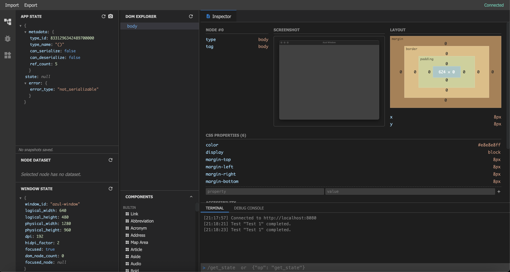
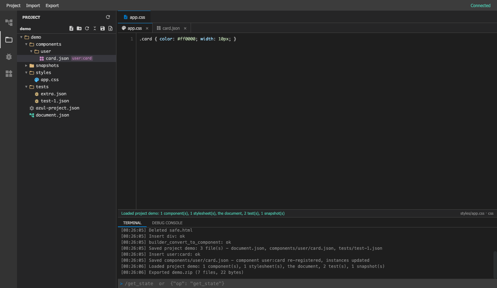
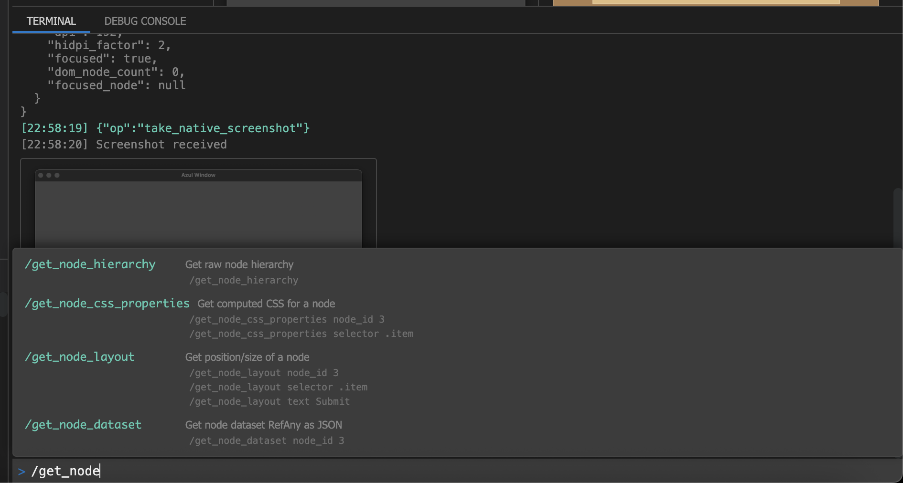
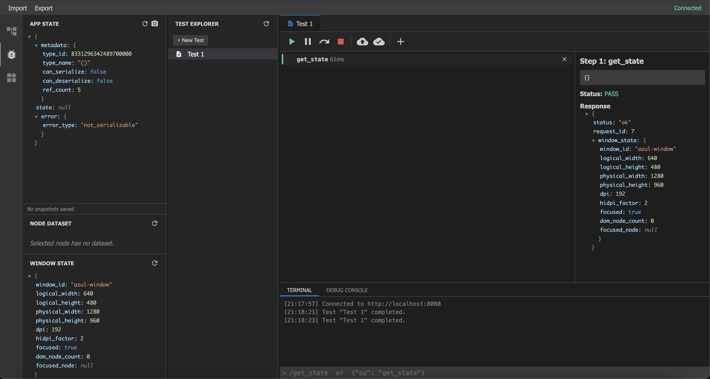
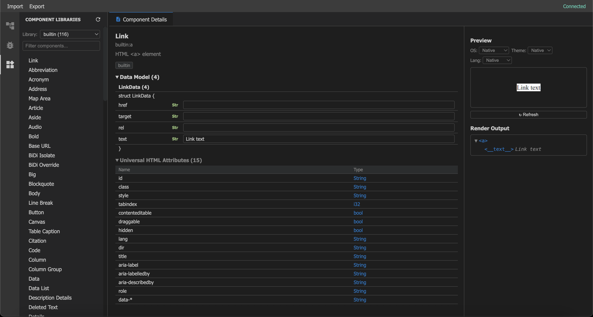

# GUI Builder

`AzBuilder` is a visual drag-and-drop GUI builder, in the spirit of Qt Creator or GTK's Glade.
The editor runs in a browser tab; the thing you edit is a real native window next to it, which
re-renders after every change. You drag components from a palette into a document, move and
undo, turn a finished piece into a reusable component, keep the whole thing as a project folder
on disk, and export it as code. The same browser tab is also the inspector and E2E test designer
for any Azul app.



## Starting the Builder

Download `AzBuilder` for your OS from the Demos section of the [releases page](https://azul.rs/ui/releases)
and run it. It opens an empty native window and a debug server on `http://localhost:8080`, and
opens that address in your default browser. The HTTP server runs on a background thread of the
same process and hands every request to the window's thread through a message queue, so the
browser can change the window while it is running.

The browser's DOM Explorer opens in **Document** mode for AzBuilder: you edit the builder's
document, not the raw DOM of the window. Switch to **Live DOM** to inspect whatever the window
shows (that is the default for any other app you run with the debug server).

## Drag and drop

The **Components** palette below the document tree shows every registered component as a card
with a thumbnail. The thumbnails are rendered by Azul's own CPU renderer, so a Button card shows
exactly the button the window will draw; the picture is also the drag image.

Drag a card onto a row of the document tree. The row tells you where the drop lands: a line
above it (before), a highlighted row (into), a line below it (after). Drops the HTML parser would
undo are refused before anything is sent - a `<div>` never goes into a `<p>`, and a text node or
a component instance takes no children. Double-clicking a card inserts it at the selection.

Rows move the same way: drag a row onto another one. Select a row and press **Delete** to remove
it, **F2** or **Enter** (or double-click) to edit its text, and use the context menu for classes,
ids, move up / down and delete. Every edit goes to the native window at once, and clicking a row
shows its live node - CSS, layout, box model - in the inspector.

## Undo and redo

Every edit of the document is one undo step: **Ctrl/Cmd+Z** undoes, **Shift+Ctrl/Cmd+Z** or
**Ctrl+Y** redoes, and the toolbar above the tree has both buttons. Undo covers the document
(inserts, moves, deletes, text and attribute edits, conversions); it does not reach into files you
saved in the project. The reset button gives the window back to the app and discards the
document.

## Convert to component

Right-click an element and choose **Convert to component…**: the subtree becomes a template
component in a library of your choice (`user` by default) and is replaced by an instance of it,
which looks exactly the same. Its texts and attributes become the component's parameters -
`text`, `text_2`, …, `href` - with the values they had as defaults. The component shows up in
the palette at once and drops again like any other; select an instance and press F2 to give it
its own text.

The Components view (the widgets icon in the activity bar) shows the component's template,
placeholders and all, with a live preview. Edit the template or its CSS there and every instance
in the window updates.

## Projects: the file viewer

A project is a folder on the machine AzBuilder runs on. Open the **Project** view (the folder
icon in the activity bar), type a path and click **Create** (or **Open** for an existing folder).
The folder gets this layout:

- `azul-project.json` - the manifest (the project's name).
- `document.json` - the builder document.
- `components/<library>/<name>.json` - one file per component you made: its parameters, its CSS
  and its template.
- `styles/` - stylesheets. Every `.css` file here applies to the document, in path order, after
  the components' own CSS.
- `tests/` and `snapshots/` - your E2E tests (one per file) and app-state snapshots.
- `export/` - a place for exported code.



The tree works like Qt Creator's: folders first, an icon per kind of file, a context menu with
**New file**, **New folder**, **Rename** (also F2) and **Delete**, and drag a file onto a folder
to move it. A new file starts from a template that fits its folder - a component file under
`components/` is a working component. Clicking a file opens it in an editor tab with syntax
highlighting for CSS, JSON, XML / HTML, Rust, C / C++, JavaScript, Python and Markdown;
**Ctrl/Cmd+S** saves it.

Saving a file the builder uses also applies it, and the status bar says what happened: a
stylesheet under `styles/` re-styles the native window, a component file re-registers the
component (every instance updates, the palette card too), and `document.json` loads the document.
A file with a mistake in it is still saved - it is your text - and the status bar says why it
was not applied.

The tree and the builder follow each other. The Inspector has a compact Project section under the
palette: select `components/user/card.json` and its palette card lights up and its first instance
is selected in the document; select an instance, or click a palette card, and its file is
selected in the tree. A component file also drags from the tree into the document, like a card.

**Project > Save Project** writes the document, every component you made, your E2E tests and your
snapshots into the folder; **Load Project** brings them all back - into a fresh AzBuilder, or over
the document you are editing after a confirmation. AzBuilder re-opens the last project when you
reload the page, and loads it into the window when the window is still empty, so restarting
AzBuilder picks up where you left off. **Export Project as ZIP** downloads the whole folder, and
**Import ZIP into Project** unpacks one into it.

Every path is relative to the project folder, and the server refuses anything that would leave
it: `..`, absolute paths, and symlinks that lead outside. The same goes for every entry of an
imported zip, and a zip with one bad entry is refused as a whole.

## Export

Once the layout is right you do not recreate it by hand. The **Export** menu turns what you built
into code in your language (Rust, C, C++, Python): the whole window as a runnable app, or the
document's components, together with the component CSS. It also exports and imports component
libraries as JSON (to share them with other projects) and your E2E tests in the format
`AZ_E2E` runs.

This completes the workflow:

1. Define your components, or convert them out of a layout you dragged together.
2. Assemble and style the UI visually, and keep it as a project.
3. Export the finished code back into your application.

## Slash Commands

Since `AzBuilder` is merely a window listening on an HTTP port, you can control it remotely with
`curl`. The browser UI is a visual interface for sending the same JSON:

```sh
# resize the AzBuilder window
curl -s -X POST http://localhost:8080/ -d '{"op": "resize", "width": 100, "height": 200}'

# insert a paragraph into the builder document (uid 0 is the <body>)
curl -s -X POST http://localhost:8080/ -d '{"op": "builder_insert", "parent": 0, "component": "p", "attrs": {"text": "Hello"}}'
```

The ops are documented in the [Debugging Guide](../debugging.md). In the browser, press "/" in
the Terminal's command line: it shows every command with examples and arguments:



Important are `"op": "take_screenshot"` and `"op": "take_native_screenshot"`, which return
Base64 PNG data that the browser UI shows. `take_screenshot` renders only the content of the
window, without the system chrome, so you can keep the image for reference tests against
regressions; the native one is meant for showcases and documentation.

The API is also useful for AI agents, which can both send the commands and look at the images.

## Designing E2E Tests

This is documented in depth in the [E2E Testing](../debugging/e2e-testing.md) guide. An end to
end test is a series of `op` steps with assertions (`assert_text`, `assert_layout`, …) in
between, and the E2E Testing view of the browser UI (the bug icon) is an editor for them that
guides you through the arguments of each op:



The green triangle runs the test against the window step by step; the cloud button runs all tests
headlessly (the `cpurender` backend runs many of them in parallel) and marks each one passed or
failed. The camera icon of the App State panel saves a named snapshot of your app state, which a
test restores with `restore_snapshot` - your UI is an `f(State) -> UI` function, so a snapshot is
a quick way into any screen.

Save the project and the tests land in its `tests/` folder, one JSON file per test, which is
exactly what the headless runner takes:

```sh
AZ_BACKEND=headless AZ_E2E=path/to/my-project/tests ./my-app
```

You get a "cargo-like" report, and the app quits when the tests are done. To try it on the
builder's own self-tests:

```sh
git clone https://github.com/fschutt/azul
cargo run --release -p azul-doc -- codegen all
CARGO_TARGET_DIR=target/demo cargo build --release -p azul-dll --features build-dll
CARGO_TARGET_DIR=target/demo cargo build --release -p AzBuilder
AZ_BACKEND=headless AZ_E2E=e2e ./target/demo/release/AzBuilder
```

shows:

```
[E2E] Dispatching 62 tests in parallel processes...
test bug-css-only-remount ... FAILED
test anim-dom-transition ... FAILED
test bug-caret-off-after-focus ... ok
test bug-font-never-removed ... ok
test anim-slow-move-frames ... ok
...
```

Run your own app the same way instead of `AzBuilder` to test your GUI.



## More methods

Everything the browser does is one of these server messages (send them with `curl` or as slash
commands).

**Document** - `builder_get_document`, `builder_insert`, `builder_move`, `builder_delete`,
`builder_set_attribute`, `builder_undo`, `builder_redo`, `builder_reset`. Every edit answers
with the whole document (a tree of nodes with stable `uid`s, `<body>` is uid 0) and re-mounts it
over the window; `builder_move` takes the slot as the drop indicator shows it, before the move.

**Components** - `builder_convert_to_component`, `get_component_thumbnail` (a PNG from the CPU
renderer, cached until the component changes), `get_component_registry`, `create_component`
(with a `render_tree` it stores a template), `update_component`, `get_component_render_tree`,
`get_component_preview`.

**Project** - `project_info`, `project_open` (with `"create": true` it makes the folder and the
skeleton), `project_close`, `project_list`, `project_read_file`, `project_write_file`,
`project_create`, `project_rename`, `project_delete`, `project_save`, `project_load`,
`project_export_zip`, `project_import_zip`. `project_write_file` answers what it applied
(`"applied": "stylesheet"`, `"component"` or `"document"`) or an `apply_error`.

**Export** - `export_code`, `export_code_zip`, `export_component_library`,
`import_component_library`.

## Cross-references

- [Components](components.md) - what a component is, and how to register your own libraries.
- [Debugging](../debugging.md) - the debug server and every op it takes.
- [E2E Testing](../debugging/e2e-testing.md) - the test format and the headless runner.
